# Bank Marketing Machine Learning

Machine Learning analysis of the UCI Bank Marketing dataset using Python, Scikit-learn, Explainable AI (XAI), Fairness analysis, and privacy-preserving techniques.

---

# Overview

This project presents a complete Machine Learning workflow for predicting whether a customer will subscribe to a bank term deposit after a direct marketing campaign.

The analysis includes data preprocessing, exploratory data analysis, dimensionality reduction, clustering, supervised learning, explainability techniques, fairness evaluation, and privacy analysis.

The project was developed as part of the Bachelor's Degree in Philosophy and Artificial Intelligence at Sapienza University of Rome.

---

# Project Objectives

The main objectives of this project are:

- Explore and understand the Bank Marketing dataset
- Perform data preprocessing and feature engineering
- Build predictive Machine Learning models
- Compare model performance
- Improve model interpretability using Explainable AI
- Evaluate fairness across demographic groups
- Analyze privacy using k-anonymity

---

# Dataset

**Dataset:** UCI Bank Marketing Dataset

The dataset contains information collected during direct marketing campaigns conducted by a Portuguese banking institution.

Each record describes a customer using demographic, financial and campaign-related variables.

The prediction target is whether the client subscribed to a term deposit.

---

# Project Workflow

- Data cleaning
- Missing value handling
- Feature encoding
- Feature scaling
- Exploratory Data Analysis (EDA)
- Principal Component Analysis (PCA)
- K-Means clustering
- Machine Learning classification
- Model evaluation
- Explainable AI (Feature Importance, PDP, LIME)
- Fairness analysis
- Privacy analysis (k-anonymity)

---

# Exploratory Data Analysis

### Customer Age Distribution

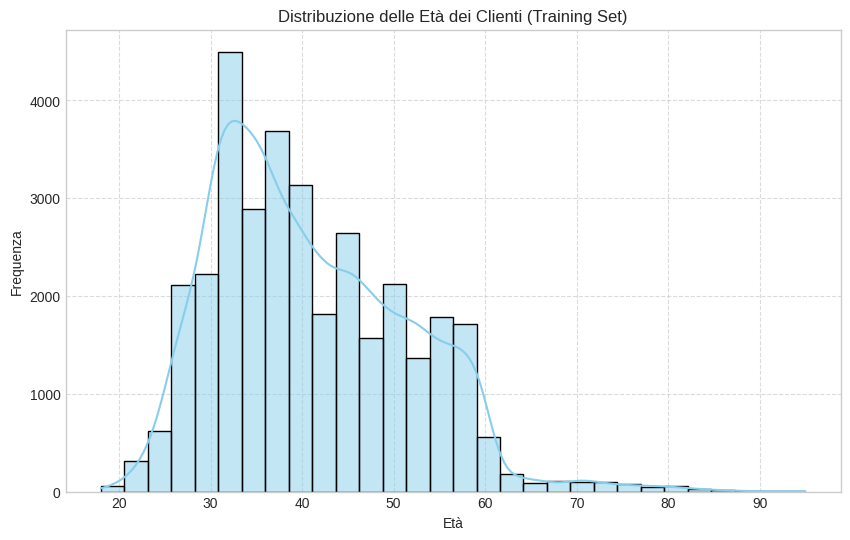

### Target Distribution

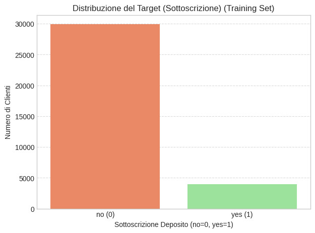

### Job Category Distribution

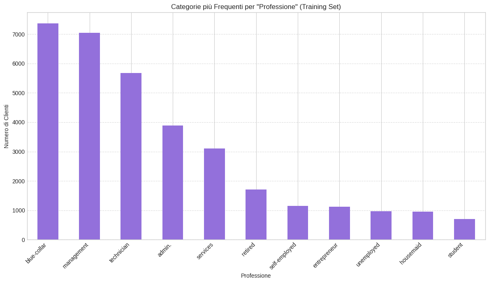

### Subscription Rate by Job

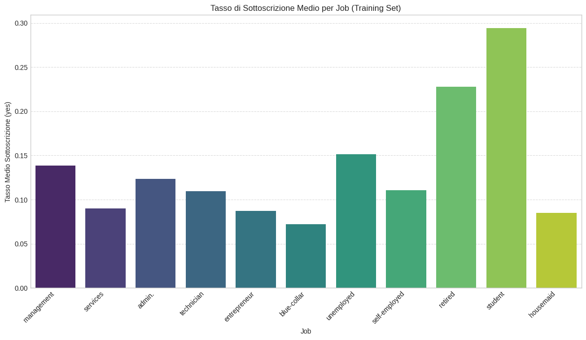

### Subscription Rate by Marital Status

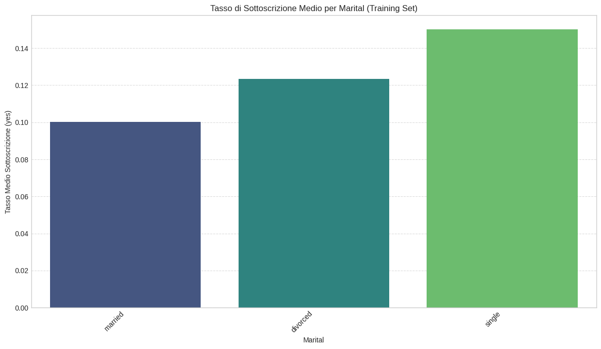

### Subscription Rate by Education

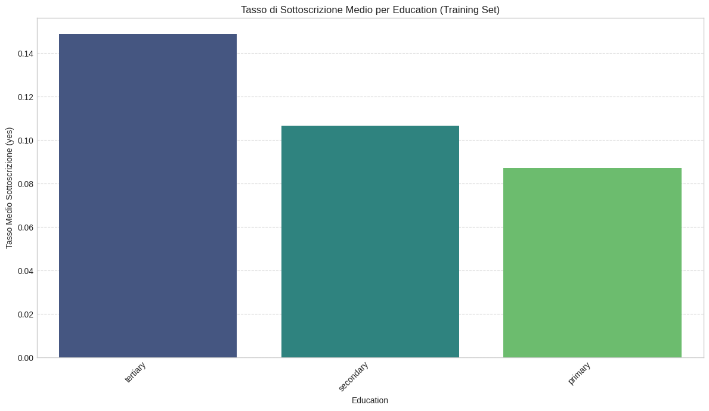

### Subscription Rate by Age Group

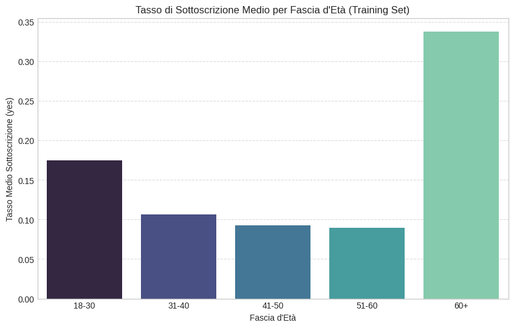

---

# Principal Component Analysis (PCA)

Principal Component Analysis was applied to reduce dimensionality and visualize customer distribution.

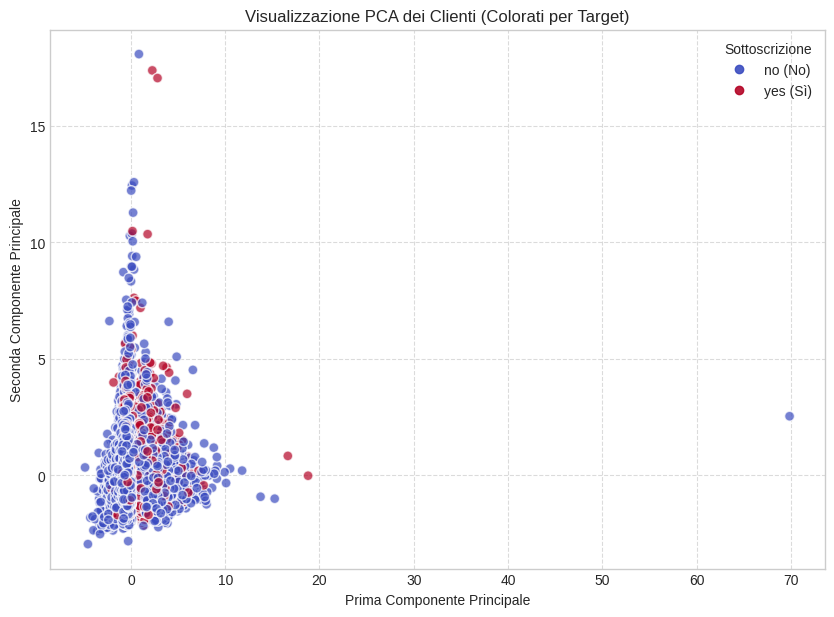

---

# Clustering Analysis

K-Means clustering was performed on PCA-transformed data to identify customer groups.

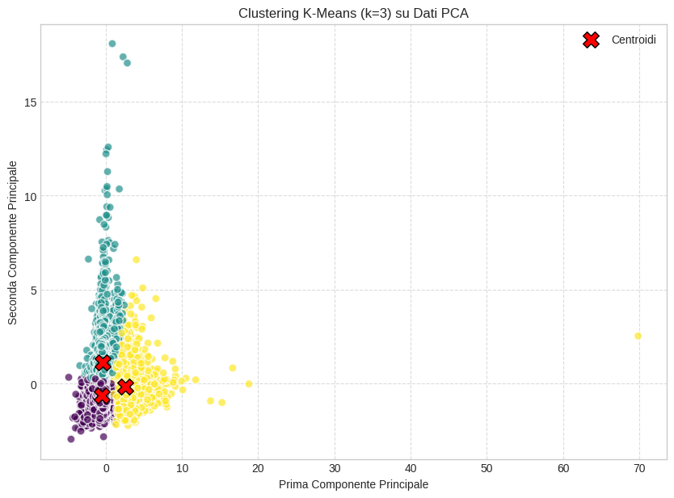

---

# Machine Learning Models

Several classification models were trained and evaluated.

The project compares:

- Logistic Regression
- Gradient Boosting

### Confusion Matrix

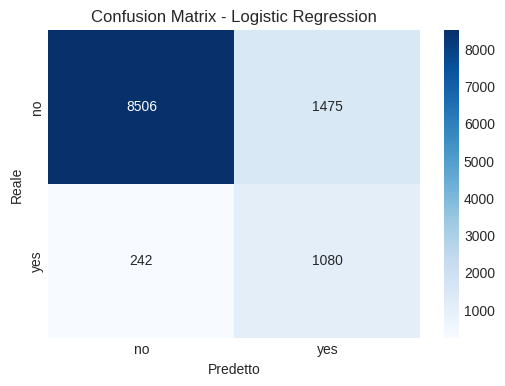

### Accuracy and F1-Score Comparison

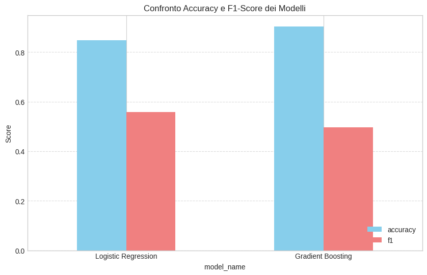

---

# Explainable AI (XAI)

Model interpretability was investigated using multiple Explainable AI techniques.

### Feature Importance

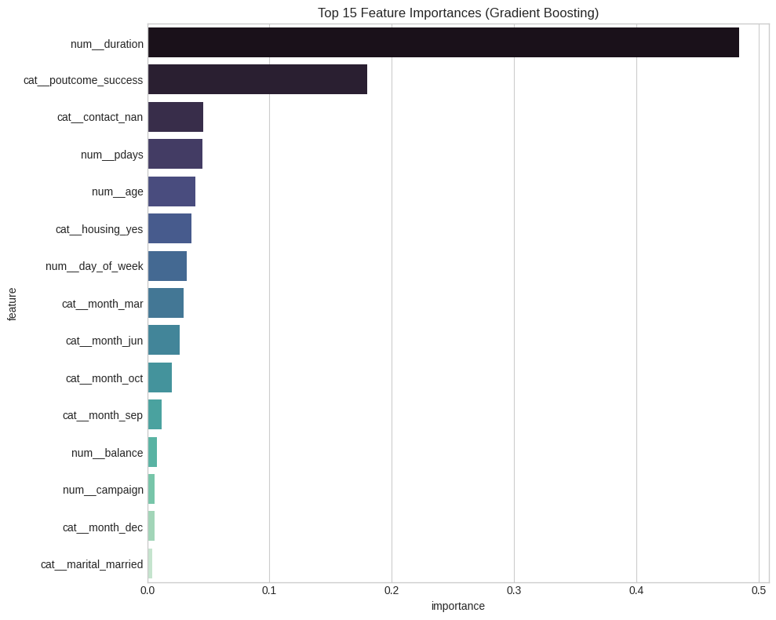

### Partial Dependence Plots

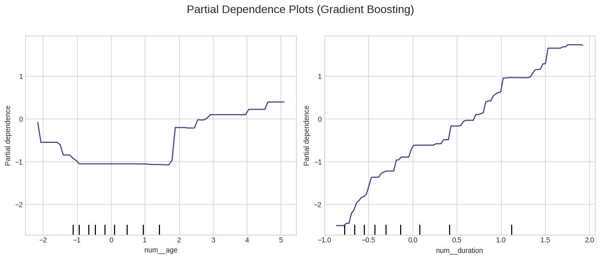

### LIME Explanation

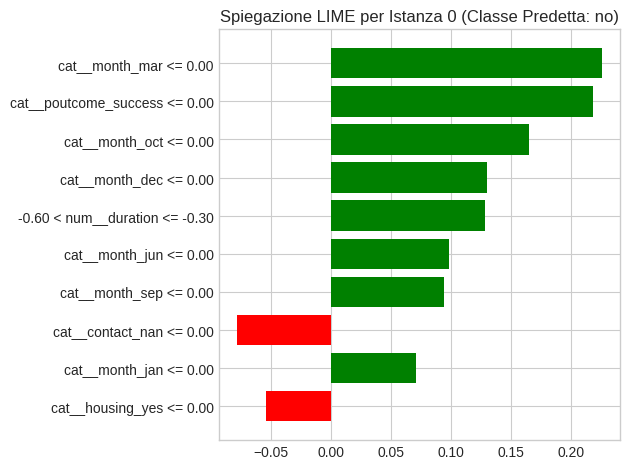

---

# AI Fairness

The project evaluates fairness using the **Disparate Impact** metric.

### Original Models

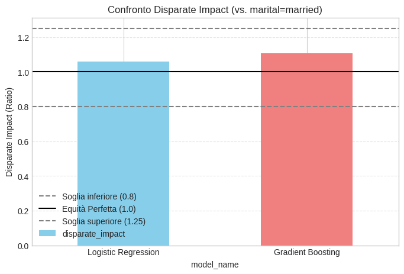

### Reweighted Model

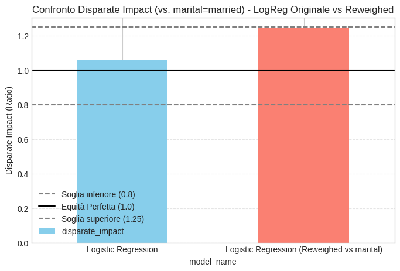

---

# Privacy Analysis

Privacy preservation was evaluated through **k-anonymity** analysis.

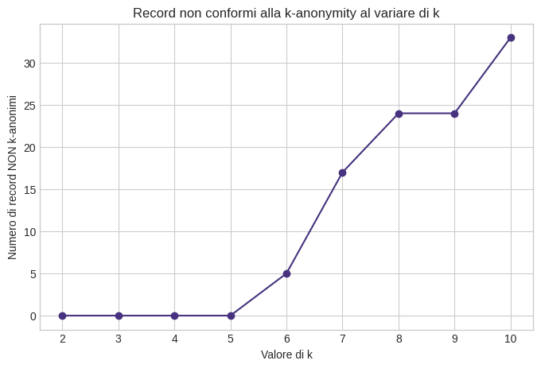

---

# Technologies

- Python
- Pandas
- NumPy
- Matplotlib
- Scikit-learn
- LIME
- AIF360
- Google Colab
- Jupyter Notebook

---

# Skills Demonstrated

- Data Cleaning
- Feature Engineering
- Exploratory Data Analysis
- Data Visualization
- Classification Models
- PCA
- Clustering
- Model Evaluation
- Explainable AI (XAI)
- AI Fairness
- Privacy-Preserving Data Analysis

---

# Author

**Sofia Rubini**

Bachelor's Degree in Philosophy and Artificial Intelligence

Sapienza University of Rome
